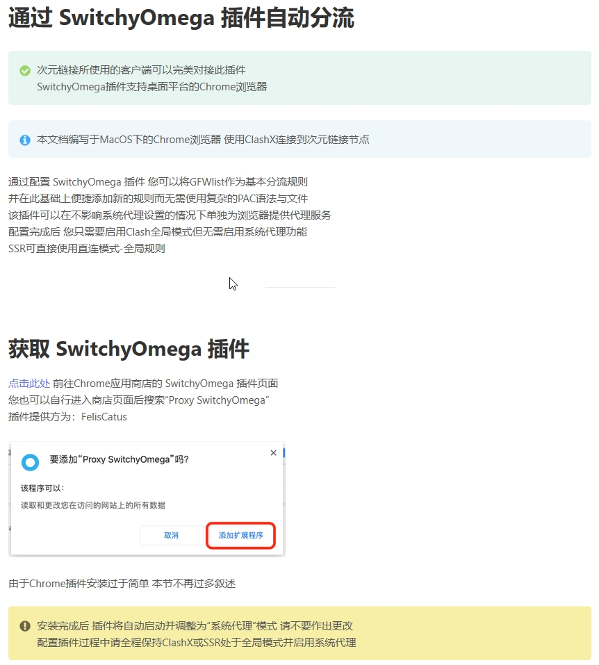
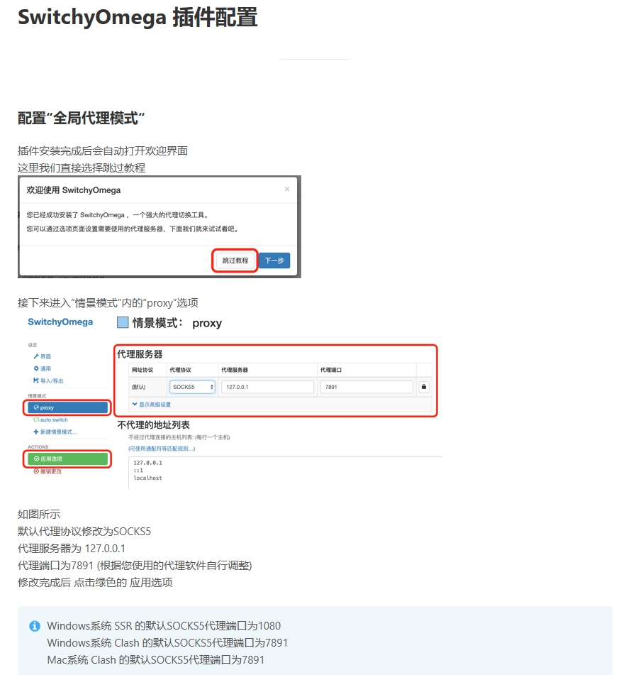
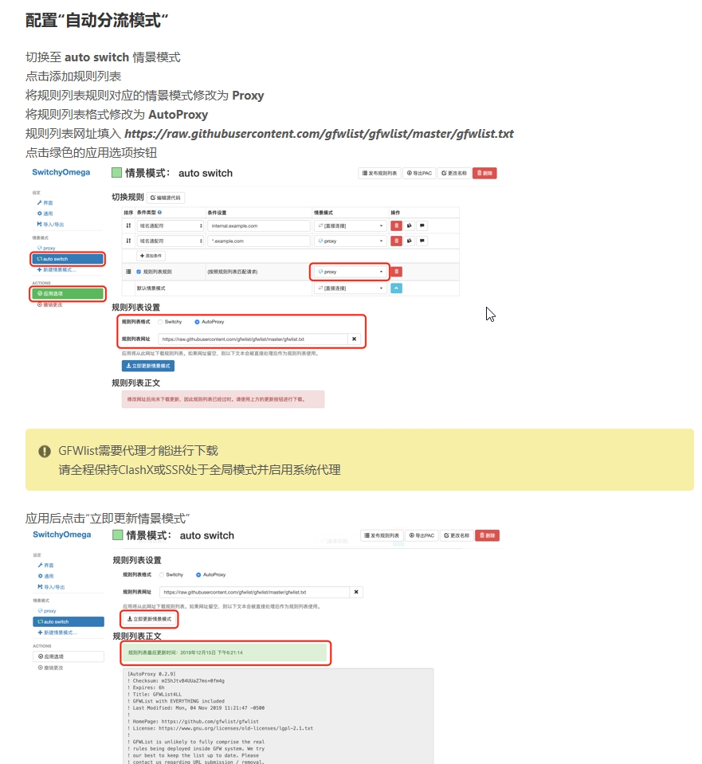
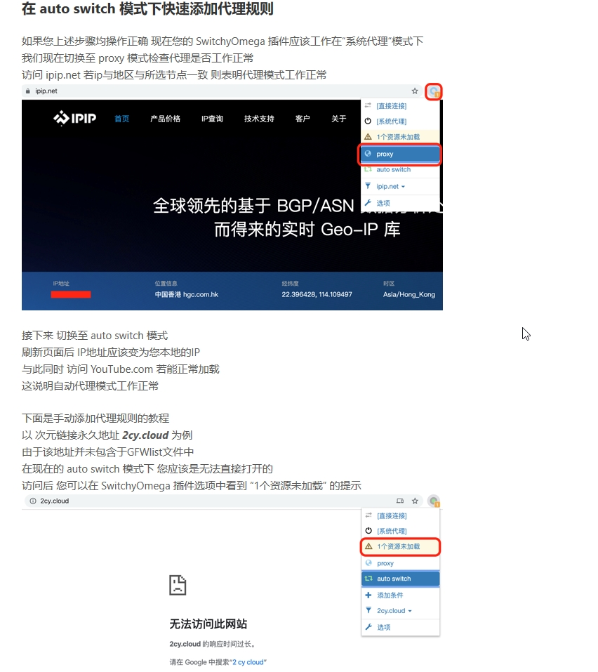
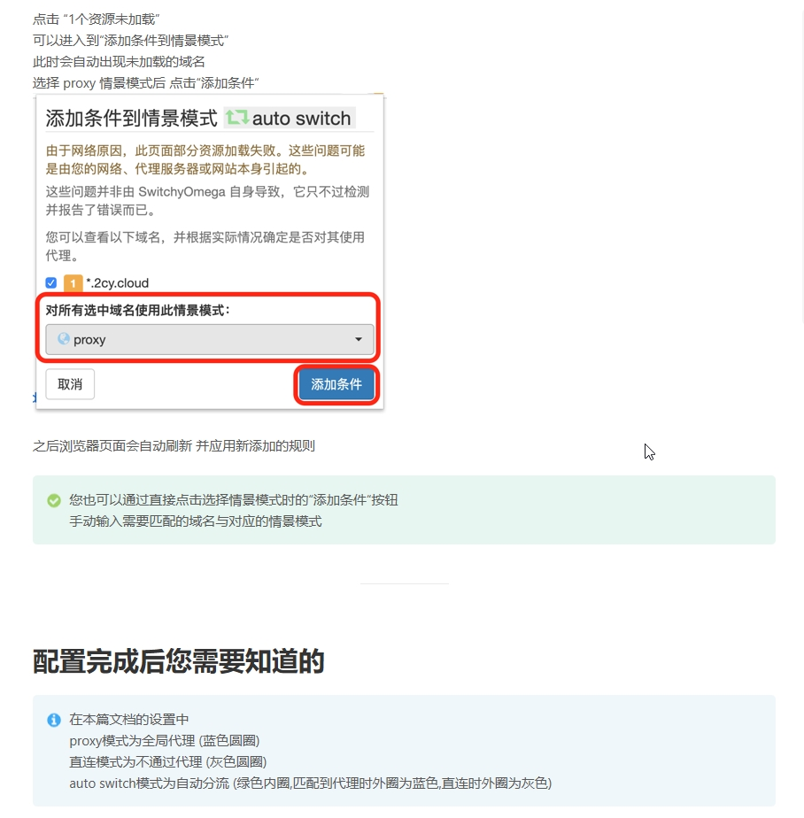
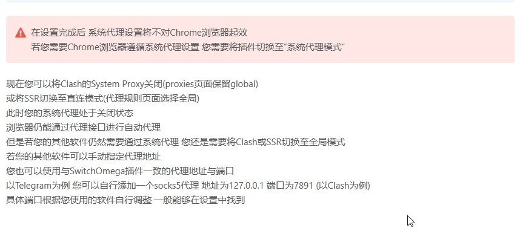

## 前言

>在天朝网络问题一直是影响办公效率的大问题，google、stackoverflow、github不是慢就是打不开，无数次想骂人，可惜pi民无论如何也想不到墙的作用。
>好用的东西当然要记录下了。

### DuangCloud
>官网：https://duangcloud.org, 具体怎么买不说，可以支付宝、微信、btc交易。
>他们家的基础使用文档也写的很清楚，这里主要记录下配置 SwitchOmega

>当灰色框内出现类似文本后即表明已经正确下载代理规则
>至此 GFWlist 分流规则已经完成部署

>最后附上原地址：<https://cylink.wiki/knowledge-base/通过-switchyomega-插件自动分流/>
